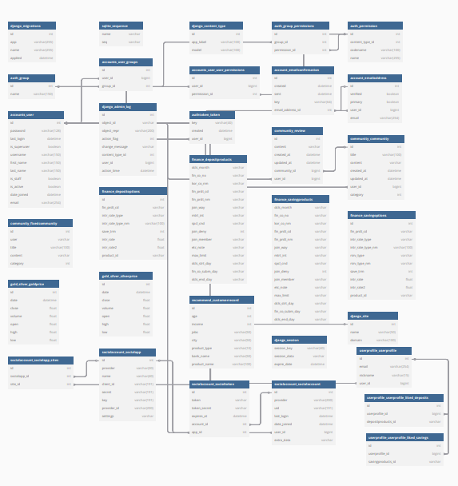

# 💸 MONEYKEY-NEKO

## 🔎 프로젝트 개요

---

## 📅 개발 일정 및 역할 분담

팀장 : 김민혁 | 상품 정보 조회 및 추천, 지도 조회 기능 구현
팀원 : 김선우 | 주식정보 검색(삭제) 및 금은 시세 시각화, 게시판 구현 및 CSS

| 날짜 | 김선우 | 김민혁 |
|------|--------|--------|
| 2025/05/22 | 로그인 구현, 게시판 기능 구현 | 회원가입 구현 |
| 2025/05/23 | 게시판 CSS 개선, 주식정보 검색(삭제), 코드 개선 | 예/적금 목록 구현, 지도 기반 기능 |
| 2025/05/24 | 금/은 시세 API 연동, 코드 개선 및 정리 | 추천 알고리즘 구현, 프로필 장바구니 |
| 2025/05/25 | 전체 CSS 정리, 챗봇 연동 | 챗봇 연동 및 회원정보 수정 기능 |
| 2025/05/26~27 | PPT 작성, 코드 개선 및 정리 | 문서 작성, 기능 오류 수정 |

---

**MONEYKEY-NEKO**는 사용자가 본인의 조건에 맞는 예/적금 상품을 필터링하고, 다양한 금융 정보(시세, 유튜브, 챗봇 등)를 통합적으로 제공받을 수 있는 **통합 금융 플랫폼**입니다.  
**주요 대상**은 금융 초보자, 사회 초년생이며, 지역 기반 금융 접근성과 정보 제공에 중점을 두고 있습니다.

---

## 🛠 기술 스택

| 구성 | 기술 |
|------|------|
| 프론트엔드 | Vue 3, Vue Router, Pinia, Bootstrap |
| 백엔드 | Django, Django REST Framework |
| DB | PostgreSQL |
| 외부 API | Kakao Map, YouTube Data API, OpenAI GPT |
| 인증 | JWT 기반 토큰 인증 |
| 기타 | Axios, Chart.js, dotenv |

---

## 📌 핵심 기능

### 👤 사용자 인증 및 프로필 관리
- 회원가입 / 로그인 / 로그아웃
- 사용자 정보 조회 및 수정
- 관심 상품(예금/적금) 등록 및 관리

### 💰 예금/적금 상품 탐색
- 상품 리스트 및 상세 정보 조회
- 조건별 필터링 및 금리 옵션 확인
- 관심 상품 찜 기능

### 🧠 AI 금융 챗봇
- GPT-4 기반 자연어 질의응답
- 금융 지식 설명 및 맞춤형 상품 추천
- 한국 금융 특성에 맞춘 응답 구성

### 📈 금/은 시세 시각화
- 실시간 금/은 가격 조회 API 연동
- 기간별 필터링 및 차트 표시

### 🗺️ 지도 기반 은행/ATM 검색
- 카카오맵 API 활용
- 사용자 주소 기반 주변 은행/ATM 검색

### 💬 커뮤니티
- 게시판 글 작성, 수정, 삭제
- 댓글 작성, 좋아요, 삭제 기능

### 🎥 유튜브 영상 검색
- 유튜브 API 연동
- 금융 키워드 기반 영상 목록 출력

### 📊 맞춤형 금융 상품 추천
- 더미 고객 데이터 기반 추천 알고리즘
- 나이, 직업, 지역, 소득 등 특성 기반 추천 결과 제공
- 선택한 특성에 해당하는 고객들이 가장 많이 사용하는 상품부터 내림차순 정렬 후 추천

---

## 🔐 보안 및 예외 처리

- JWT 인증 기반 사용자 보안 확보
- 인증된 사용자만 주요 기능 접근 가능
- 비어 있는 입력, 토큰 만료, 잘못된 요청 등에 대한 방어 처리
- 금융 상품 및 사용자 관련 모델/시리얼라이저 검증 강화

---

## 🗃 데이터 구성 및 초기 로드

```bash
python manage.py loaddata articles.json gold_prices.json silver_prices.json customers.json finances.json
```

- 금융 상품: `DepositProducts`, `SavingProducts` (옵션 테이블 포함)
- 시세 데이터: `GoldPrice`, `SilverPrice`
- 추천용 고객 데이터: `recommend_customerrecord`
- 관심 상품 저장 테이블: `liked_deposits`, `liked_savings`

---

## 📡 API 명세 요약

### 인증 및 회원 관리
- `POST /accounts/signup/`
- `POST /accounts/login/`
- `POST /accounts/logout/`
- `GET /accounts/user/`

### 사용자 프로필 관련 (/api/v1/)
- `POST /api/v1/profile/`
- `GET /api/v1/profile/my_profile/`
- `POST /api/v1/profile/like-deposit/<id>/`
- `like-saving/<id>/`
- `PUT /api/v1/profile/edit`

### 금융 상품 관련 (/api/v2/)
- `GET /api/v2/deposit-products/`  
- `GET /api/v2/saving-products/`  
- `GET /api/v2/deposit-product-options/<fin_prdt_cd>/`  
- `GET /api/v2/saving-product-options/<fin_prdt_cd>/`  
- `GET /api/v2/deposit-options/`
- `GET /api/v2/saving-options/`  
- `GET /api/v2/get-product-code/`  
- `GET /api/v2/load/deposits/`  
- `GET /api/v2/load/deposit-options/`  
- `GET /api/v2/load/savings/`  
- `GET /api/v2/load/saving-options/`  
- `POST /api/v2/save-products/`  

### 게시판 (/api/v3/)
- `GET /api/v3/articles/`
- `GET /api/v3/articles/<article_pk>/`
- `POST /api/v3/articles/`
- `POST /api/v3/articles/<community_pk>/reviews/`
- `DELETE /api/v3/articles/<community_pk>/reviews/<review_pk>/`
- `GET /api/v3/fixed_articles/`
- `GET /api/v3/fixed_articles/<pk>/`

### 금/은 시세 (/api/v4/)
- `GET /api/v4/gold_prices/`
- `GET /api/v4/silver_prices/`

### 챗봇 (/api/v5/)
- `POST /api/v5/`

### 추천 (/api/v6/)
- `GET /api/v6/recommend/`

---

## 🧩 시스템 구성도 및 ERD

- Django DRF 기반 REST API 구성
- Vue 3 컴포지션 API 기반 프론트 구현
- PostgreSQL 기반 정규화된 DB 및 추천 데이터 구성
- 주요 테이블 관계는 ERD 참고



---

## 🤖 생성형 AI 활용 내용

- OpenAI GPT API를 활용한 **금융 챗봇** 기능 구현
- 추천 알고리즘 설계에 필요한 **고객 더미 데이터** 생성

---

## 📂 디렉토리 구조 (프로젝트 전체 구성)

<pre> <code>
final-pjt/
├── back/                        # Django 백엔드
│   ├── accounts/               # 회원가입 및 인증
│   ├── chatbot/                # 챗봇 관련 API
│   ├── community/              # 게시판 기능
│   ├── finance/                # 예/적금 상품 및 옵션 API
│   ├── gold_silver/            # 금/은 시세 정보 API
│   ├── project/                # Django 프로젝트 설정 (settings.py 등)
│   ├── recommend/              # 추천 알고리즘 로직
│   ├── userprofile/            # 사용자 프로필, 관심상품 저장 등
│   └── manage.py               # Django 실행 파일
│
├── db.sqlite3                  # SQLite3 데이터베이스 (개발용)
│
└── front/                      # Vue 프론트엔드
    ├── public/                # 정적 리소스 (favicon, index.html 등)
    ├── src/
    │   ├── assets/            # 이미지, 아이콘 등
    │   ├── components/        # 재사용 가능한 Vue 컴포넌트
    │   ├── router/            # Vue Router 설정
    │   ├── stores/            # 상태 관리 (Pinia)
    │   ├── views/             # 페이지 단위 구성
    │   ├── App.vue            # 메인 컴포넌트
    │   └── main.js            # 진입 파일
    ├── index.html             # Vue HTML 템플릿
    ├── vite.config.js         # Vite 설정 파일
    └── .env                   # 프론트엔드 환경변수 설정
</code> </pre>


## 👏 마무리

본 프로젝트는 금융 초보자를 위한 실질적이고 맞춤화된 서비스를 목표로 하며,  
다양한 공공 및 오픈 API와 생성형 AI 기술을 융합한 현대적 금융 플랫폼입니다.

## 김민혁

처음 해보는 프로젝트라 시작 단계에서 많은 어려움과 막막함을 느꼈습니다.
하지만 좋은 팀원과 함께 하나씩 해결해 나가며, 생각보다 훨씬 높은 완성도의 결과물을 만들 수 있었습니다
이번 경험은 2학기 관통 프로젝트를 준비하는 데 든든한 밑거름이 될 것 같습니다.

## 김선우

짧은 프로젝트 기간에 비해 요구사항이 많아서 부담감이 컸지만, 잘 마무리할 수 있어 다행입니다.
최대한 학습한 내용을 이용하여 코드를 작성하고 정리하고자 했으나,
시간이 짧아 보다 가독성 있는 코드, 커스텀된 기능을 더 추가하지 못해 아쉽습니다.
특정 연령층을 타겟팅한 사이트를 만들었다면 더욱 매력있는 프로젝트를 완성했을 텐데 아쉽습니다. 
그러나 python부터 django, javascript, vue까지 한 학기동안 배운 기술들이 이렇게 많다니,
기술들을 활용하여 프로젝트를 완성해내다니 스스로의 성장이 느껴져 뿌듯합니다.


---